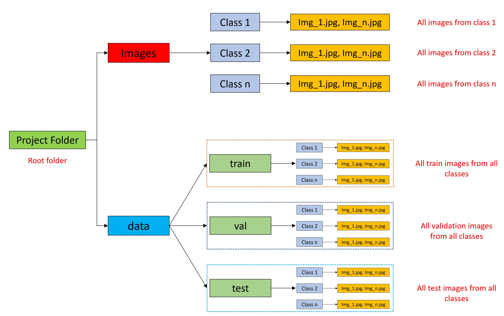
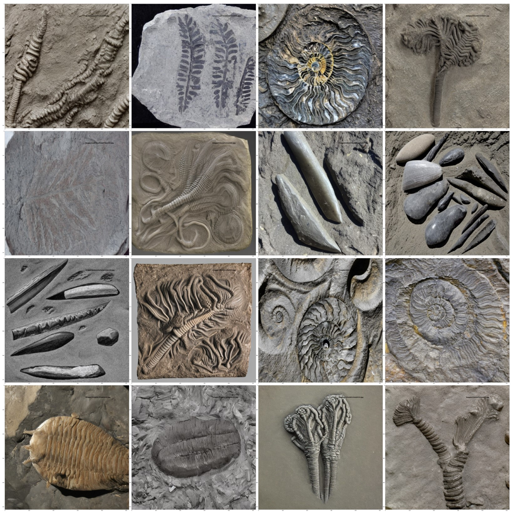
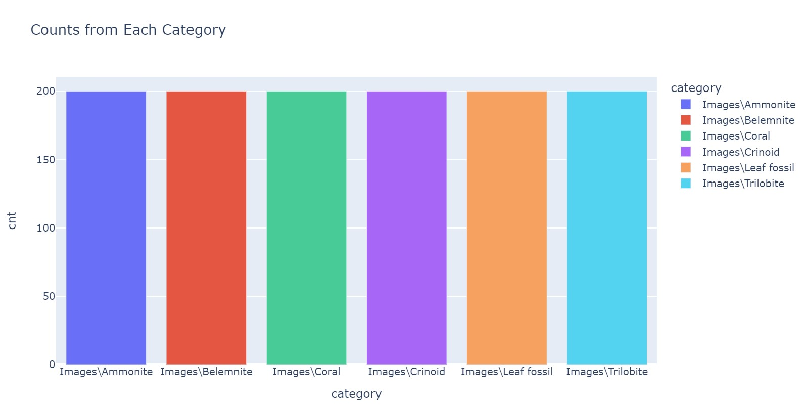
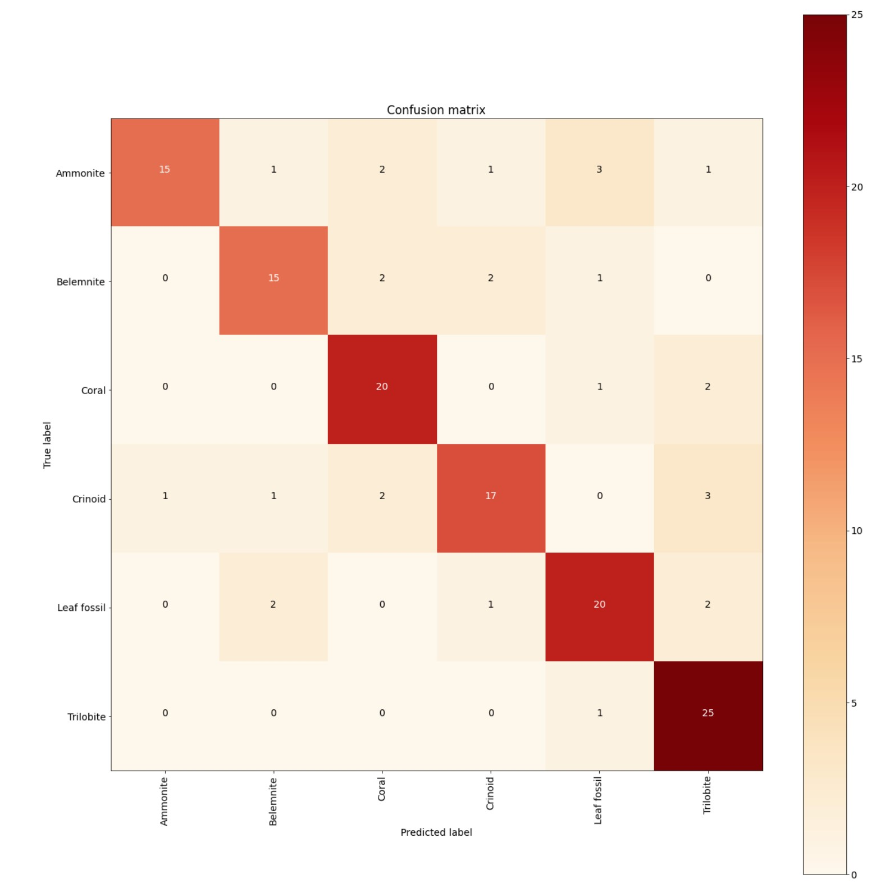
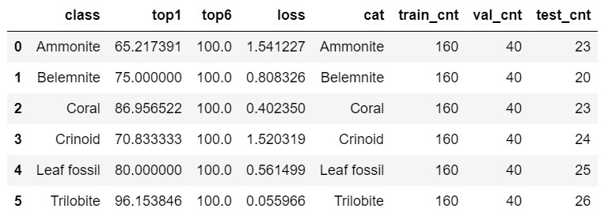

# Fossil-Image-Classification-with-Pytorch
This repository demonstrates the application of a custom Image Classification model on a synthetic geological fossil dataset.

As introduced in my other repository, the custom model used for this project can work on any custom dataset. A brief explanation of the model structure and use can be found on (https://github.com/AthanasiosNathanail/Image-Classification-with-Pytorch-on-a-Custom-Dataset).

Fossils and their understanding play an important role to the explanation and interpretation of the geology. The correct characterization and classification of fossils can provide useful information and assist in the interpretation of a depositional environment. Therefore, the goal of the presented application is to provide a tool for geologists to automatically classify fossils among different classes.

The dataset used for this project is a synthetic dataset I generated myself with the help of artificial intelligence to enrich real-world fossil datasets. Synthetic data is an excellent solution to small datasets as the synthetic data can increase the number of images per class, significantly improve the variability of the dataset at hand, and as demonstrated from the results of this project, and can also be used as a stand-alone dataset to train a fossil classifier. 

Let's dive in the code!

## Installation

```bash
pip install -r requirements.txt
```

If you are a beginner with anaconda and environment management you can follow the instructions below.

To install requirements.txt in the environment, we have to use the pip installed within the environment. 
Thus, we should install pip first by

```bash
conda install pip
```

Then we can install the requirements.txt. Of course, there is a better way. 
We simply create a conda environment with pip installed in it:

```bash
conda create -n yourenv pip
```

Or if you want to specify your python version for this conda environment, conda create -n python=3.7 yourenv pip
Now you can run the following command to complete the installation.

```bash
pip install -r requirements.txt
```

For additional information please visit the link for the official anaconda documentation
1) https://www.anaconda.com/products/distribution (Anaconda installation)
2) https://conda.io/projects/conda/en/latest/user-guide/tasks/manage-environments.html (Managing Anaconda Environments)
3) https://towardsdatascience.com/getting-started-guide-anaconda-80a4d30d3486 (Beginner's Anaconda Tutorial)

Once the anaconda environment is set up, you can download the code from this repository in a zip file, unzip it and place everything in a folder of your choice.

## Dataset

The dataset is open access and can be downloaded from the following link: https://zenodo.org/record/7510741#.Y7voc3ZBwuV
For more information about the specific synthetic data stay tuned for my upcoming publication where I fully describe the dataset.

After downloading and unzipping the data, all the images should be put in the corresponding folders and follow the structure explained in my Image Classification repo (https://github.com/AthanasiosNathanail/Image-Classification-with-Pytorch-on-a-Custom-Dataset). The structure is also summarized in the following figure.



Once all the data is in place, we can start running the script. 

Here are a few images for the visualization of our data.





## Inference and Results

Upon the completion of the training step, the confusion matrix is generated. The overall test accuracy of the model across all classes is 0.7943, which is good, but it can definitely be improved by further modifying the model.








For the specific run of the model and results shown, the model was trained for 63 epoches, using a RAM of 16GB, Processor: Intel(R) Core(TM) i7-10700K CPU @ 3.80GHz 3.79 GHz, and a GPU: NVIDIA GeForce RTX 2080 Super. 
The parameters used for the particular hardware were:
'batch_size': 16
'number of workers': 2

I compiled all the results for all classes into a pdf file (Fossil Classification Results.pdf) for results evaluation. For a detailed evaluation of the results, please do not hesitate to contact me to discuss.

If you have read this far, I really appreciate it. If you enjoyed this project and found it helpful, please share it so you can help another developer improve their projects.

## Contributing

Pull requests are welcome. For major changes, please open an issue first to discuss what you would like to change.

## References

1. https://medium.com/bitgrit-data-science-publication/building-an-image-classification-model-with-pytorch-from-scratch-f10452073212
2. https://pytorch.org/vision/stable/models.html
3. https://www.anaconda.com/products/distribution
4. https://conda.io/projects/conda/en/latest/user-guide/tasks/manage-environments.html 
5. https://towardsdatascience.com/getting-started-guide-anaconda-80a4d30d3486
6. https://github.com/AthanasiosNathanail/Image-Classification-with-Pytorch-on-a-Custom-Dataset/edit/main/README.md
7. https://zenodo.org/record/7510741#.Y7voc3ZBwuV

## License

[MIT](https://choosealicense.com/licenses/mit/)

